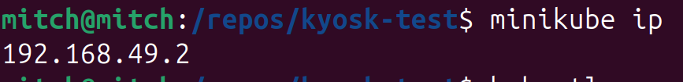
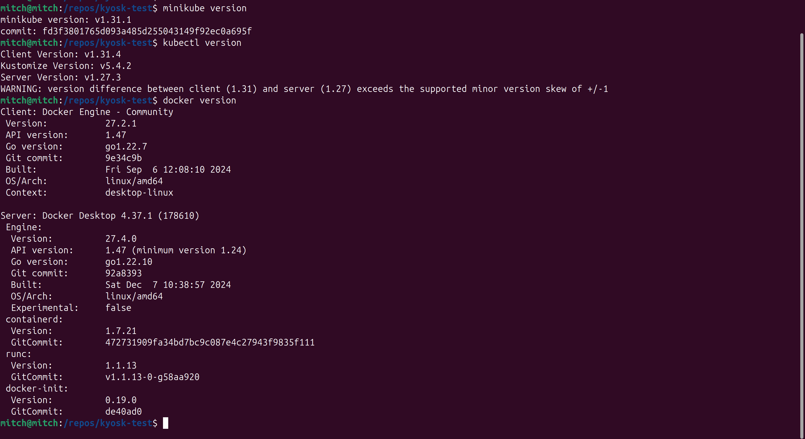

# kyosk-test

[](https://github.com/ajharry69/kyosk-test/actions/workflows/ci-cd.yml)

A simple spring boot application that provides an API endpoint for listing books.

## Building and Running

### Using (Plain) Docker

#### What you will need

1. [Install docker][docker-installation-url].

#### Start mongo DB

The following command assumes:

1. ports **27017** and **8081** are not in use.
2. the command is running on a [Unix-based system](https://en.wikipedia.org/wiki/List_of_Unix_systems).

#### Start the application

The application
has [Spring boot docker compose integration](https://docs.spring.io/spring-boot/how-to/docker-compose.html) for faster
development.
Mongo DB will automatically be pulled and started before the application is fully started.

```bash
./gradlew bootRun
```

#### Accessing the API

##### Using browser

1. Open your favorite web browser.
2. Visit `http://localhost:8080/books` in a new browser tab.

##### Using curl

###### What you will need

1. [Install curl][install-curl-url].

###### Access the application

Show a list of prepopulated books.

```bash
curl --request "GET" \
      --header "Accept: application/json" \
      --url 'http://localhost:8080/books'
```


### Using Kubernetes (k8s)

#### What you will need

1. [Install docker][docker-installation-url].
2. [Install kubectl](https://kubernetes.io/docs/reference/kubectl/).
   1. [Install for linux](https://kubernetes.io/docs/tasks/tools/install-kubectl-linux/).
   2. [Install for macOS](https://kubernetes.io/docs/tasks/tools/install-kubectl-macos/).
   3. [Install for Windows](https://kubernetes.io/docs/tasks/tools/install-kubectl-windows/).
3. [Install minikube](https://minikube.sigs.k8s.io/docs/start/).

#### Start minikube

```bash
minikube start
```

#### Apply k8s manifests

The following command assumes that [Start minikube](#start-minikube) phase is done successfully.

```bash
kubectl apply --filename k8s/
```

#### Get information on the k8s resources

The following command assumes that [Apply k8s manifests](#apply-k8s-manifests) phase is done successfully.

```bash
kubectl get all
```


#### Accessing the API

The following commands assume that [Building & Running](#building-and-running) phase is done successfully.

##### Getting minikube IP

```bash
minikube ip
```



##### Using browser

1. Open your favorite web browser.
2. Visit `http://$(minikube ip):30100/books` in a new browser tab.

##### Using curl

###### What you will need

1. [Install curl][install-curl-url].

###### Access the application

```bash
curl --request "GET" \
      --header "Accept: application/json" \
      --url 'http://$(minikube ip):30100/books'
```

## CI/CD

Continuous Integration (CI) & Continuous Deployment (CD) pipeline is running on GitHub Actions.

### How it works

When changes have been pushed to the `main` branch or pull request is open to the `main` branch, the **CI** job is run.
In the CI phase,

1. the repository is first checked out (cloned locally).
2. the mongo db versions (7 & 8) are set up and started. This will be used later.
3. Java version 21 from the temurin distribution is set up.
   Our application being a java application, will need it for the subsequent steps.
4. Gradle is configured for optimal use of GitHub Actions resources through caching of downloaded dependencies.
5. Build the application using the Gradle wrapper script to ensure everything in terms of application configuration is
   in order.
6. Run the automated tests included in the application using the Gradle wrapper script to ensure all the components are
   in working order.

When a new release tag with the pattern `v*.*.*` is pushed, the **CD** job is run.
But before the CD phase is run, the **CI** phase must run successfully to ensure we do not deploy broken docker images.

A new release tag can be cut as follows:

```bash
git tag --annotate v1.0.0 --message "Version 1.0.0"
```

and pushed to GitHub as follows:

```bash
git push --tags
```

## DISCLAIMER

The provided guidelines were tested on an ubuntu 24.04 machine with the following versions of prerequisite software
programs:



[install-curl-url]: https://curl.se/download.html

[docker-installation-url]: https://docs.docker.com/engine/install/
