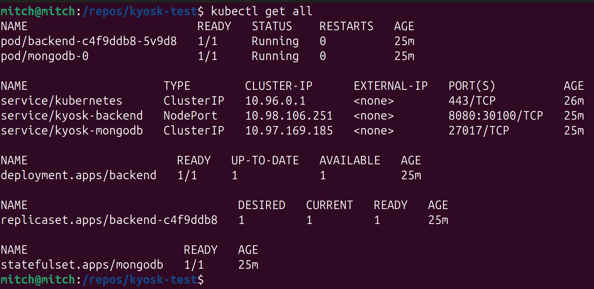
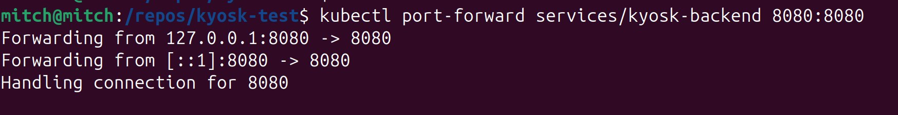
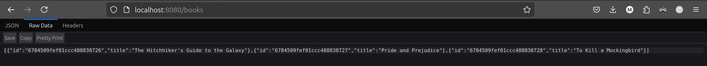
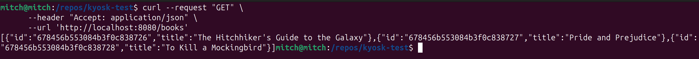

# kyosk-test

[](https://github.com/ajharry69/kyosk-test/actions/workflows/ci-cd.yml)

A simple spring boot application that provides an API endpoint for listing books.

## Technologies Stack

| Technology       | Version                             | Description                                                                                   |
|------------------|-------------------------------------|-----------------------------------------------------------------------------------------------|
| JAVA             | 21                                  | backend programming language                                                                  |
| Spring boot      | 3.4.1                               | backend framework                                                                             |
| MongoDB          | 8.0                                 | NoSQL document database                                                                       |
| Docker (Engine)  | 27.2.1                              | Containerisation                                                                              |
| Kubernetes (k8s) |                                     | Container orchestration                                                                       |
| Kubectl          | v1.27.3 (server) & v1.31.4 (client) | Command line tool for interacting with kubernetes APIs                                        |
| Minikube         | v1.31.1                             | allow running single-node kubernetes cluster on personal computer for development and testing |

## Building and Pushing The Docker Image

The following instructions outline how to **manually** build and push the docker image to GitHub Container registry.

> **N/B:** The automatic way of achieving the same is outlined in the [CI/CD section](#cicd).

### What you will need

1. [Install docker][docker-installation-url].

### Build the docker image

```bash
docker build --tag ghcr.io/<your-github-username>/kyosk-test:v1 .
```

### Authenticate GitHub Container Registry

Please
check [here](https://docs.github.com/en/packages/working-with-a-github-packages-registry/working-with-the-container-registry#authenticating-with-a-personal-access-token-classic)
for information on where to get the password.

```bash
docker login ghcr.io --username <your-github-username> --password-stdin
```

### Push the docker image

```bash
docker image push ghcr.io/<your-github-username>/kyosk-test:v1
```

## Building and Running

### Using (Plain) Docker

#### What you will need

1. [Install docker][docker-installation-url].

#### Start mongo DB

The following command assumes:

1. ports **27017** and **8081** are not in use.
2. the command is running on a [Unix-based system](https://en.wikipedia.org/wiki/List_of_Unix_systems).

#### Start the application

The application
has [Spring boot docker compose integration](https://docs.spring.io/spring-boot/how-to/docker-compose.html) for faster
development.
Mongo DB will automatically be pulled and started before the application is fully started.

```bash
./gradlew bootRun
```

### Using Kubernetes (k8s)

#### Source code

Please check the [k8s](k8s) directory for the kubernetes manifest (`.yaml` files).

#### What you will need

1. [Install docker][docker-installation-url].
2. [Install kubectl](https://kubernetes.io/docs/reference/kubectl/).
   1. [Install for linux](https://kubernetes.io/docs/tasks/tools/install-kubectl-linux/).
   2. [Install for macOS](https://kubernetes.io/docs/tasks/tools/install-kubectl-macos/).
   3. [Install for Windows](https://kubernetes.io/docs/tasks/tools/install-kubectl-windows/).
3. [Install minikube](https://minikube.sigs.k8s.io/docs/start/).

#### Start minikube

```bash
minikube start
```

#### Apply k8s manifests

The following command assumes that [Start minikube](#start-minikube) phase is done successfully.

```bash
kubectl apply --filename k8s/
```

#### Get information on the k8s resources

The following command assumes that [Apply k8s manifests](#apply-k8s-manifests) phase is done successfully.

> **N/B:** this is optional, but can be helpful in debugging when things are not working as expected.

```bash
kubectl get all
```



#### Start port-forwarding

This assumes port **8080** is not in use.

```bash
kubectl port-forward services/kyosk-backend 8080:8080
```



## Accessing the API

### Using browser

1. Open your favorite web browser.
2. Visit `http://localhost:8080/books` in a new browser tab.



### Using curl

#### What you will need

1. [Install curl][install-curl-url].

#### Access the application

Show a list of prepopulated books.

```bash
curl --request "GET" \
      --header "Accept: application/json" \
      --url 'http://localhost:8080/books'
```



## CI/CD

Continuous Integration (CI) & Continuous Deployment (CD) pipeline is running on GitHub Actions.

### Source code

[.github/workflows/ci-cd.yml](.github/workflows/ci-cd.yml)

### How it works

When changes have been pushed to the `main` branch or pull request is open to the `main` branch, the **CI** job is run.
In the CI phase,

1. the repository is first checked out (cloned locally).
2. the mongo db versions (7 & 8) are set up and started. This will be used later.
3. Java version 21 from the temurin distribution is set up.
   Our application being a java application, will need it for the subsequent steps.
4. Gradle is configured for optimal use of GitHub Actions resources through caching of downloaded dependencies.
5. Build the application using the Gradle wrapper script to ensure everything in terms of application configuration is
   in order.
6. Run the automated tests included in the application using the Gradle wrapper script to ensure all the components are
   in working order.

When a new release tag with the pattern `v*.*.*` is pushed, the **CD** job is run.
But before the CD phase is run, the **CI** phase must run successfully to ensure we do not deploy broken docker images.

A new release tag can be cut as follows:

```bash
git tag --annotate v1.0.0 --message "Version 1.0.0"
```

and pushed to GitHub as follows:

```bash
git push --tags
```

This will automatically trigger the docker image building and pushing to GitHub container registry upon successful
execution of the **CI** job.

> We've chosen **GitHub Container Registry** to avoid managing separate authentication secrets for our container
> registry.
> Since our code, CI/CD pipelines, and container images all reside on GitHub, authentication is handled
> seamlessly within the platform.

[install-curl-url]: https://curl.se/download.html

[docker-installation-url]: https://docs.docker.com/engine/install/
